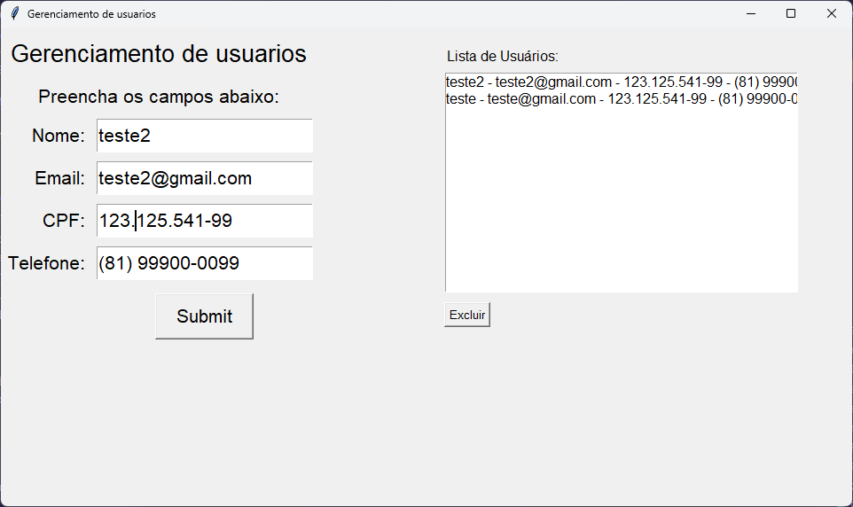

# Projeto App de Gerenciamento de Usuários

Este projeto é um exemplo de aplicação desktop em Python usando `tkinter` para criar uma interface gráfica simples de cadastro e gerenciamento de usuários.



## Visão Geral

A pasta `app` contém uma aplicação estruturada em camadas:

- `main.py`: ponto de entrada da aplicação.
- `view/`: interface gráfica e widgets do aplicativo.
- `model/`: repositório de dados em memória.

A aplicação permite:
- cadastrar usuários com nome, email, CPF e telefone;
- exibir a lista de usuários cadastrados;
- remover um usuário selecionado da lista.

## Estrutura de Pastas

```
app/
  main.py
  README.MD
  model/
    ListaUserss.py
  view/
    AppTkinter.py
    Campos_Aplicativo.py
```

### `main.py`

- Cria a instância principal de `AppTkinter`.
- Chama `run_app()` para iniciar a interface.

### `model/ListaUserss.py`

- Define `UserRepo`, uma classe responsável por armazenar a lista de usuários em memória.
- Métodos principais:
  - `add_user(user: dict)`: adiciona um novo usuário no início da lista.
  - `delete_user(index: int)`: remove um usuário pelo índice selecionado.
  - `get_users()`: retorna a lista atual de usuários.
- Exporta `repo`, a instância global do repositório usada pela interface.

### `view/AppTkinter.py`

- Define a classe `AppTkinter` herdando de `tk.Tk`.
- Configura a janela principal com título, tamanho e estilo de fonte.
- Cria os widgets da interface através de `Campos_Aplicativo`.
- Inicia o loop principal do `tkinter` em `run_app()`.

### `view/Campos_Aplicativo.py`

- Implementa a maior parte da interface e a lógica de interação.
- Cria campos de entrada (`Entry`) para:
  - Nome
  - Email
  - CPF
  - Telefone
- Cria um `Listbox` para mostrar os usuários cadastrados.
- Botões:
  - `Submit`: cadastra o usuário preenchido.
  - `Excluir`: remove o usuário selecionado da lista.
- Método `__cadastrar()` captura os dados dos campos, cria um dicionário e insere no repositório.
- Método `exclude_user()` remove o item selecionado no `Listbox`.
- Método `update_list()` atualiza a exibição de usuários na interface.

## Funcionamento

1. O usuário abre a aplicação executando `main.py`.
2. A janela principal é exibida com os campos de entrada e a lista de usuários.
3. O usuário preenche os campos e clica em `Submit`.
4. Os dados são adicionados ao repositório em memória e a lista é recarregada.
5. Para excluir um usuário, seleciona um item na lista e clica em `Excluir`.

## Comportamento dos Dados

- Os dados são mantidos apenas em memória enquanto o aplicativo estiver aberto.
- Não há persistência em banco de dados ou arquivo.
- O repositório armazena os usuários em `repo.list_users`.

## Observações

- A interface utiliza posicionamento misto: `grid` para os campos de entrada e `place` para a lista e botão de exclusão.
- O projeto é ideal para fins de estudo de `tkinter`, organização MVC simples e manipulação básica de listas.
- Para adicionar persistência, seria necessário implementar leitura/gravação em arquivo ou integração com banco de dados.
